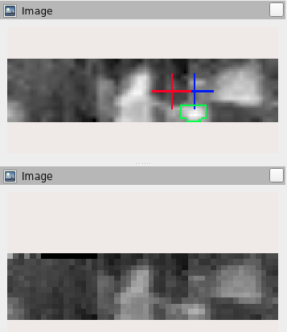
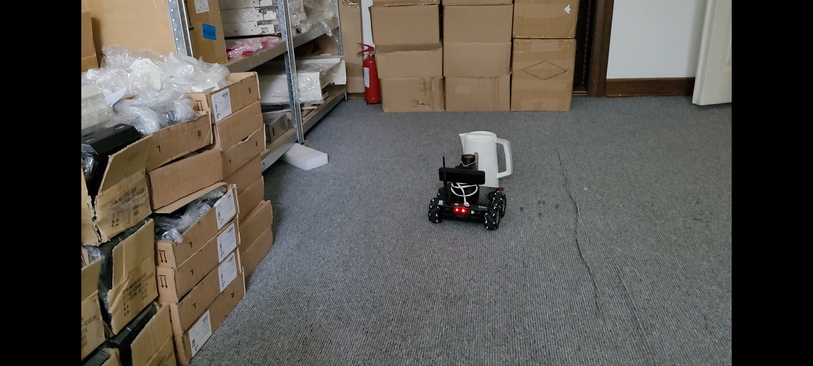
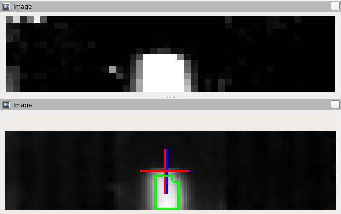

# Heat Follower

## Description

**Heat Follower** is a robot based on the ROSbot Pro platform, that follows heat by using a 360 degree thermal camera.

## Hardware

Hardware used in this project:
 - [ROSbot PRO](https://husarion.com/manuals/rosbot/#rosbot-pro)
 - [IR Thermal Sensor Array](https://www.melexis.com/en/product/mlx90641/high-operating-temperature-fir-thermal-sensor-array)
 - [Slip Ring](https://www.sparkfun.com/products/13064)
 - [Custom PCB designed in Eagle](https://github.com/husarion/heat-follower-robot/tree/main/CAD/PCB)
 - [Custom enclosure designed in Fusion 360](https://github.com/husarion/heat-follower-robot/tree/main/CAD)
 
## Software

### Thermal Camera

Software for Thermal Camera is written in [PlatformIO](https://platformio.org/) IDE to ensure compatibility with multiple platforms. MLX90641 [API](https://github.com/melexis/mlx90641-library) is used to ensure proper communication with the IR Sensor. It is slightly modified to support STM32's hardware.
Micro-ROS libraries are mandatory to communicate with ROSbot.

### ROS2 Python Node

A simple node was written in Python to process the input thermal image and steer the robot.

### ROS Description

 Topic | Node Name | Description 
 --- | --- | ---
 `/thermal_image` | `/thermal_camera` | Raw thermal image represented with grayscale image (temperature = pixel intensity/100). 
 `/tc_image_devel` | `/thermal_subscriber`| Normalized image with target object contours. 
 `/tc_goal_angle` | `/thermal_subscriber`| Arrow marker pointing at the target angle relative to the robot. 
 
Additionally there are 3 parameters

 Parameter | Node Name | Type | Description
 ---  | --- | --- | ---
 `target_min_temp` | `/thermal_subscriber` | int | Minimum temperature of object 
 `target_max_temp` | `/thermal_subscriber` | int | Maximum temperature of object
 `go_to_hottest_piont` | `/thermal_subscriber` | bool | If true, robot follows the hottest object. If false, robot follows object which temperature is within `target_min_temp` and `target_max_temp`.
 
## Building the project

### Flashing MCU

Open the project with [Visual Studio Code](https://code.visualstudio.com/) with [PlatformIO](https://platformio.org/install/ide?install=vscode) plugin.

**This project is optimized for STM32F4 MCU's - keep that in mind when flashing on your hardware!**

Click **PlatformIO: Upload** button 

### Running on ROSbot

Clone **robot** folder to your ROSbot, connect the Thermal Camera via USB and run
`docker-compose -f docker-compose.yaml up`
After downloading all the necessary docker images ROSbot should follow warm objects nearby.
### Running Rviz on PC

Clone **pc** folder to your PC and run:
`xhost local:root` 
and then:
`docker-compose -f compose.pc.yaml up`

Rviz should now pop up showing ROSbots surroundings in deep infrared.

If images are not visible click **Add** -> **By topic** -> **/thermal_image**

Here's ROSbot looking at kettle:

